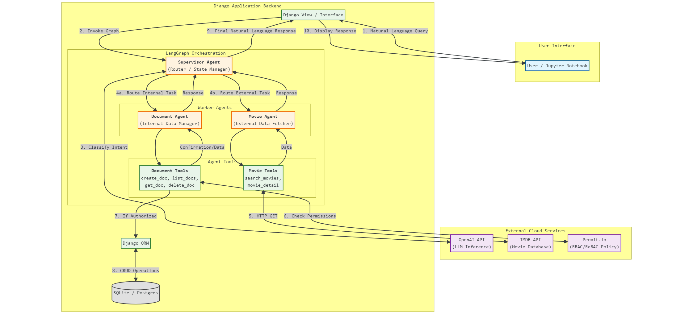

# Django AI Agent System
A multi-agent AI application built with **Django**, **LangGraph**, and **Permit.io**. This system features a generic Supervisor agent that orchestrates specialized tasks between a Document management assistant and a Movie discovery assistant, ensuring secure, permission-based access to data.

  

## Features

* **Multi-Agent Orchestration:** A Supervisor agent intelligently routes user queries to the correct sub-agent (Document vs. Movie).
* **Secure Document Management:** Create, list, retrieve, update, and delete text documents via natural language commands.
* **Movie Discovery:** Fetch real-time movie data (search, details) using the TMDB API.
* **Role-Based Access Control (RBAC):** Integrated with Permit.io to enforce permissions at the tool level (e.g., verifying a user can "delete" before the agent executes the action).

## Data Models

The system relies on the standard Django Authentication User model and a custom Document model to store user data.

### 1. User (`auth_user`)
* **Source:** `django.contrib.auth.models.User`
* **Description:** The standard Django user model used for authentication and ownership relations.

### 2. Document (`documents_document`)
* **Source:** `src/documents/models.py`
* **Description:** The core entity managed by the Document Assistant agent.

| Field Name | Type | Description |
| :--- | :--- | :--- |
| **id** | `BigAutoField` | Unique Primary Key. |
| **owner** | `ForeignKey` | Links to the `User` model (`on_delete=CASCADE`). |
| **title** | `CharField` | The title of the document (Default: "Title"). |
| **content** | `TextField` | The body text of the document (Nullable). |
| **active** | `BooleanField` | Soft deletion flag (Default: `True`). |
| **active_at** | `DateTimeField` | Timestamp for when the document became active. |
| **created_at** | `DateTimeField` | Automatically set when the document is created. |
| **updated_at** | `DateTimeField` | Automatically updated whenever the document is saved. |
